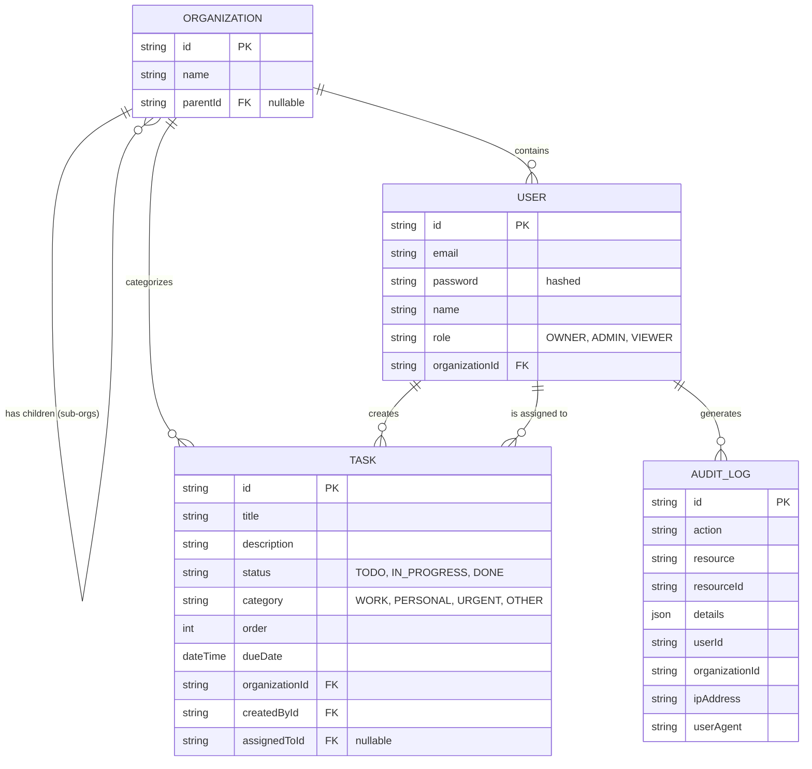

# Secure Task Management System

A secure Task Management System built with a modular Nx monorepo architecture, NestJS backend, and Angular frontend. The system focuses on Role-Based Access Control (RBAC), allowing users to manage tasks securely based on organizational hierarchy and assigned roles.

## 🚀 Setup Instructions

### Prerequisites
- Node.js (v18+)
- npm

### Installation
1. Install project dependencies:
```bash
npm install
```

### Environment Variables
For the backend `.env` configuration, create a file at `apps/api/.env` with the following variables:
```env
# Database configuration (SQLite used for local development/testing)
DATABASE_TYPE=sqlite
DATABASE_DATABASE=task.db

# JWT Configuration
JWT_SECRET=super_secret_jwt_key_for_development_only
JWT_EXPIRATION=1h
```

### Running the Applications

**Run the Backend (NestJS API):**
```bash
npx nx serve api
```
The API will run at `http://localhost:3000/api`

**Run the Frontend (Angular Dashboard):**
```bash
npx nx serve dashboard
```
The dashboard will run at `http://localhost:4200/`

---

## 🏗️ Architecture Overview

The system is designed as a modular **Nx monorepo**. This structure forces decoupled code, creates strict module boundaries, and enables caching and faster builds.

### Workspace Layout
- `apps/api/`: The NestJS backend application. It handles routing, database connections, controllers, and services.
- `apps/dashboard/`: The fully responsive Angular frontend application using TailwindCSS.
- `libs/data/`: Shared TypeScript interfaces, enums, DTOs, and common types used by both frontend and backend safely, preventing drift.
- `libs/auth/`: Reusable RBAC logic, JWT validation strategies, Guards, and Decorators for the backend validation pipeline.

By separating the logic into `libs`, the core business domains (`auth`, `data`) can be easily shared or independently tested without booting the massive primary `apps`.

---

## 🗄️ Data Model

The application uses an SQLite database manipulated by TypeORM, containing four primary entities: `User`, `Organization`, `Task`, and `AuditLog`.

### Mini ERD



### Schema Description
- **Organization**: Supports a recursive 2-level hierarchy where a child organization can optionally belong to a parent organization.
- **User**: Represents team members tied exclusively to a specific Organization role.
- **Task**: The central resource. Tasks strictly point to the creating user, an optional assigned user, and the surrounding organization.
- **Audit Log**: Immutable trails of every Create, Update, and Delete task action, stamped with User IDs, IPs, and organization tracking.

---

## 🔐 Access Control Implementation

Role-Based Access Control (RBAC) securely limits users to viewing exactly what their role dictates. 

### Roles & Visibility Rules
* **OWNER**: A super admin who can do everything inside their organization. They can see all tasks created by everyone in their organization **AND** all tasks from matching sub-organizations recursively. They can view the Master Audit Log.
* **ADMIN**: Similar broad task visibility across the organization and its sub-organizations. They can also view the Audit log.
* **VIEWER**: Restricted access. Viewers can only view or edit tasks that they **created themselves**, OR tasks explicitly **assigned to them**. They are strictly forbidden from viewing the Audit log or full User list.

### JWT Integration
1. The user inputs credentials via `POST /api/auth/login`.
2. The backend validates credentials and signs a JWT containing the user's `sub` (ID), `role`, and `organizationId`.
3. The frontend `auth.interceptor` automatically attaches the token `Bearer <token>` to all HTTP requests.
4. The backend `JwtAuthGuard` intercepts incoming requests, validates the signature, and populates `req.user`.
5. The custom `@Roles()` decorator and `RolesGuard` verify if the user's role matches the requirements of the endpoint before entering controller logic.

---

## 📡 API Documentation

### Authentication Base
**Login**
```bash
curl -X POST http://localhost:3000/api/auth/login \
  -H "Content-Type: application/json" \
  -d '{"email":"owner@company.com","password":"Password123"}'
```
*Returns:* `{ "accessToken": "eyJhbG..", "user": { "id":"...", "email":"...", "role":"OWNER"} }`

### Tasks
*(Include `Authorization: Bearer <token>` in the header for all following endpoints)*

**Get Tasks (Filtered by Org/Role)**
```bash
curl -X GET http://localhost:3000/api/tasks
```
*Returns:* `[ { "id": "...", "title": "Buy milk", "status": "TODO", "assignedToId": "..." }, ... ]`

**Create Task**
```bash
curl -X POST http://localhost:3000/api/tasks \
  -H "Content-Type: application/json" \
  -d '{"title":"New Task","category":"WORK","assignedToId":null}'
```

**Update Task**
```bash
curl -X PUT http://localhost:3000/api/tasks/<task-uuid> \
  -H "Content-Type: application/json" \
  -d '{"status":"IN_PROGRESS", "order":1}'
```

**Delete Task**
```bash
curl -X DELETE http://localhost:3000/api/tasks/<task-uuid>
```

### Audit Log (OWNER/ADMIN only)
**Get Org Audit Logs**
```bash
curl -X GET http://localhost:3000/api/audit-log
```

---

## 🧪 Testing Strategy

The workspace uses **Jest** for the Backend and **Vitest** for the Frontend.

### Running Backend Tests (NestJS + TypeORM)
```bash
npx nx test api
npx nx e2e api-e2e
```
*Coverage:* Tests validate the RBAC Guards, JWT logic, Task manipulation boundaries (e.g. Viewer trying to delete an Admin's task returns 403), and valid payload data mapping.

### Running Frontend Tests (Angular)
```bash
npx nx test dashboard
```
*Coverage:* Tests successfully cover `TaskBoardComponent` drag-and-drop state updates, `AuthService` token manipulation, component re-rendering limits on filter changes, and verifying that the Interceptor attaches the token strictly.

---

## 🚧 Tradeoffs & Future Considerations

While the current architecture properly covers core requirements, several things were omitted for brevity and speed in this challenge:

**Tradeoffs made:**
* **SQLite vs PostgreSQL:** SQLite was selected for trivial local execution without needing Docker or a local daemon. Naturally, migrating to PostgreSQL with a connection pool is necessary for high-throughput production.
* **Pagination omitted:** The `/tasks` and `/audit-log` endpoints currently fetch all records tied to the organization. A robust production app would use strictly limit/offset or cursor-based pagination.
* **Soft Deletes Missing:** Tasks deleted using `@Delete()` are hard-removed from the database. Typical real-world enterprise databases employ `deletedAt` soft deletes for archival safety and auditing retrieval.

**Future Considerations for Production:**
1. **JWT Refresh Tokens:** Currently, the system uses simply a short-lived access token. Future systems should pair this with an HttpOnly cookie-bound `refreshToken` for better session continuity.
2. **CSRF Protection:** Add CSRF tokens to safeguard the API from cross-site scripting hijacks when migrating auth logic into strictly cookie borders.
3. **Advanced Role Delegation:** Instead of hardcoded strings (`OWNER`, `VIEWER`), moving towards a Permissions Table mapping exactly which granular action flags array (`task:create`, `task:delete`, `audit:read`) map to customized User Roles.
4. **Caching Permission Checks:** Utilize Redis caches bound to user sessions to avoid hitting the DB strictly for hierarchy evaluations on heavily spammed GET endpoints.


**Creds**
1. **Viewer Role:** Email: bob@company.com | Password: Password123
2. **Admin Role:** Email: admin@company.com | Password: Password123
3. **Owner Role:** Email: alice@company.com | Password: Password123
